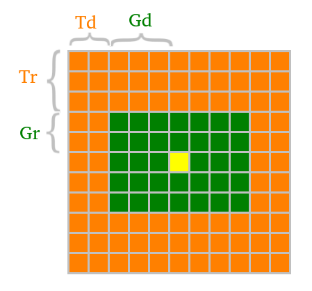

# Radar Notes

The main project script is `radar_07_final_project.m`.


## CFAR Implementation Description

CFAR stands for constant false alarm rate, which can refer
to any signal processing method that adapts thresholds to local signal data.
Here we implement a CFAR method in which an averaging window is scanned across
the 2D range doppler signal to determine the threshold at the center of
the window.

Specifically, we choose dimensions `Td`, `Tr`, `Gd`, `Gr` to determine a window shape
as follows:



The orange cells are called _training cells_, the green cells are called
_guard cells_, and the yellow cell is the _cell under test_.
The threshold chosen for the yellow cell is:
```
threshold = [average of signal power in orange cells] + [offset]
```

In the code we chose `Tr=10`, `Td=8`, `Gr=4`, and `Gd=4`, with `offset=10`.

As the window is scanned along the 2D range doppler map,
some positions along the edge of the map never coincide with the yellow cell.
These positions are in strips of width `Td` on the left and right of the matrix,
and in strips of height `Tr` on the top and bottom of the matrix.
We zero out the signal in these cells, effectively dropping them from the range doppler map.
